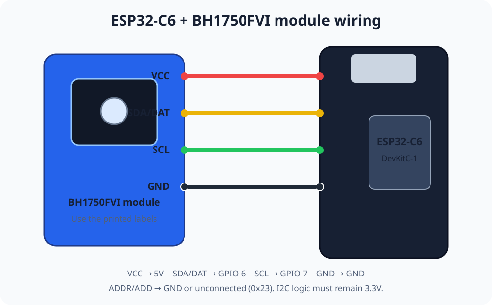

# ESP32 BH1750FVI 实时看板技能

[英文版](README.md)

这个技能用于构建完整的 ESP32-C6 和 BH1750FVI 环境光监控器，包括硬件接线、项目生成、Zero EMQX 一次性命名空间、固件烧录、串口验证，以及本地或 Cloudflare 远程实时看板。

## 使用方法

```sh
git clone https://github.com/emqx/thing-loom.git
cd thing-loom/bh1750
codex
```

然后输入：

```text
帮我构建一个环境光监控器。
```

智能体会指导接线，通过本地终端隐藏提示收集凭据，在征得同意后创建隔离的 Zero EMQX 命名空间，烧录固件，使用 MQTTX 验证真实照度消息，并打开实时看板。



请按照传感器模块上的丝印接线：

| BH1750FVI 模块 | ESP32-C6 |
|---|---|
| `VCC` | `5V` |
| `SDA` / `DAT` | `GPIO 6` |
| `SCL` | `GPIO 7` |
| `GND` | `GND` |
| `ADDR` / `ADD` | 接地或悬空（地址为 `0x23`） |

本文使用的转接模块支持 5V 输入，裸 BH1750FVI 芯片不支持直接接入 5V。上电前请确认其他模块会将 SDA 和 SCL 稳压或转换为 3.3V 电平，禁止将 5V 逻辑电平直接接入 ESP32 GPIO。

## 发布方式与安全

- **本地页面：**直接打开生成的 `web/public/index.html`，不会使用 Cloudflare。
- **远程地址：**使用 Cloudflare Workers 静态资源部署同一页面，最小权限 API Token 只通过终端隐藏提示输入。

Zero EMQX 提供需要认证的 MQTTS 和 WSS。脚手架将无线网络、MQTT 和可选 Cloudflare 凭据写入 `data/<项目名>/.env`，文件权限为 `600`。生成项目和所有 `.env` 文件都被 Git 忽略。

远程静态页面必然包含一次性 Zero MQTT 的 WSS 凭据，因此只适合隔离的演示环境。私有或生产看板需要带鉴权的后端和可长期使用的消息服务。

## 默认硬件与工具

- ESP32-C6-DevKitC-1
- BH1750FVI 转接模块
- USB-C 数据线
- 2.4 GHz 无线网络

技能只安装缺少的组件：

```sh
brew install arduino-cli
brew install emqx/mqttx/mqttx-cli
arduino-cli core install esp32:esp32
arduino-cli lib install BH1750 PubSubClient
```

MQTTX 会在不使用 `--insecure` 的情况下通过 MQTTS 验证真实消息。固件使用系统 CA Bundle，并在 TLS 握手前完成校时。
