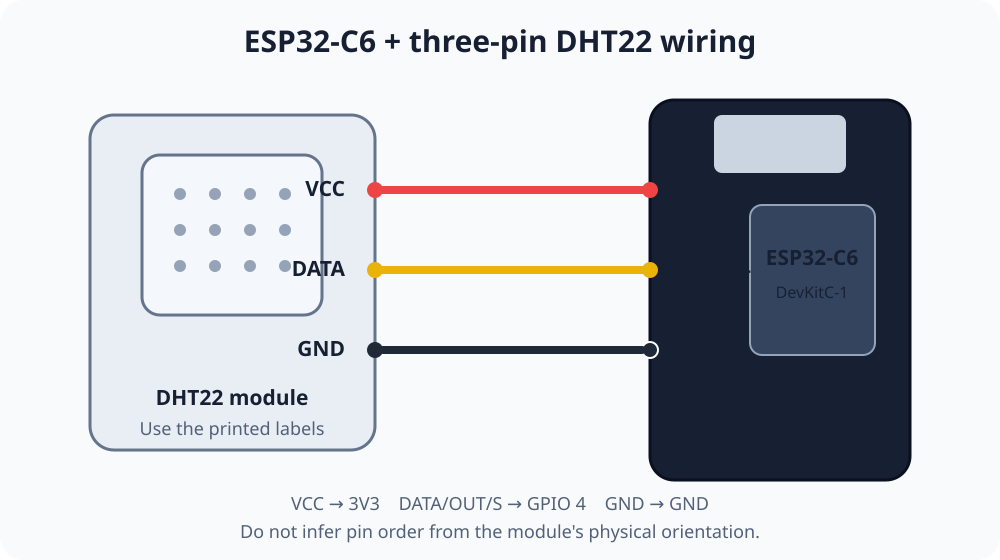

# ESP32 DHT22 实时看板技能

[英文版](README.md)

这个技能用于构建完整的 ESP32-C6 和三针 DHT22 项目，包括硬件接线、项目生成、
Zero EMQX 或自有 MQTT Broker 配置、固件烧录、串口验证，以及本地或 Cloudflare 远程实时
看板。

## 使用方法

克隆 `thing-loom`，进入传感器目录，然后启动 Codex 或其他支持 `SKILL.md` 的
智能体：

```sh
git clone https://github.com/emqx/thing-loom.git
cd thing-loom/dht22
codex
```

然后输入：

```text
帮我构建一个温湿度监控器。
```

智能体会依次完成：

1. 确认 ESP32 已通过可传输数据的 USB 线连接，并确认 DHT22 接线正确。
2. 只通过本地终端的隐藏提示获取无线网络密码，绝不通过聊天收集。
3. 询问使用一次性的 Zero EMQX 还是自己的 Broker。
4. 使用自有 Broker 时，在本地填写 MQTT 与 WebSocket 连接信息，并由 MQTTX 验证两个入口后才写入项目文件。
5. 询问看板使用本地 HTML 文件还是 Cloudflare 远程地址。
6. 远程模式下，通过隐藏提示获取限定到目标账户的最小权限 Cloudflare API Token。
7. 生成、编译并烧录固件，然后从串口确认真实传感器读数。
8. 使用 MQTTX CLI 验证消息已到达 Broker，再打开看板确认收到同一条数据。



请按照 DHT22 模块上的丝印接线，不要根据物理针脚顺序猜测：

| DHT22 | ESP32-C6 |
|---|---|
| `VCC` / `+` | `3V3` |
| `DATA` / `OUT` / `S` | `GPIO 4` |
| `GND` / `-` | `GND` |

## 本地与远程看板

- **本地 HTML：**直接打开生成的 `web/public/index.html`，不需要 Cloudflare 账户。
- **远程地址：**使用 Cloudflare Workers 静态资源部署同一个页面。API Token 只在本地输入，并保存在被 Git 忽略的 `.env` 文件中。

远程静态页面必须获得 MQTT WSS 凭据，因此访问者可以在浏览器中
检查到该凭据。这个模式只适合隔离的演示环境。私有或生产看板需要带鉴权的后端和
非一次性 Broker。

## Broker、凭据与生命周期

默认使用 Zero EMQX。传入 `--broker custom` 后，可以填写自有 Broker 的主机、设备
端口、`mqtt`/`mqtts` 协议、用户名、隐藏密码，以及单独的 `ws://`/`wss://` 看板
地址。脚手架会先用 MQTTX 验证两个入口，成功后才创建输出目录；远程看板必须使用
`wss://`。脚手架将以下内容写入
`data/<项目名>/.env`，文件权限为 `600`：

- 无线网络名称和密码
- Broker 来源、协议、MQTT/WebSocket 地址、用户名、密码和 Topic
- 选择 Zero EMQX 时的实例编号和生命周期
- 远程模式使用的 Cloudflare API Token

所有生成代码都保存在当前传感器目录的 `data/` 文件夹下。该文件夹内容和所有
`.env` 文件都被 Git 忽略。不要分享凭据文件。继续已有项目时，应复用其 `.env`
和 Zero 实例；如果串口已经出现有效的 `Published` 读数，不要再次编译或烧录。

默认生命周期是 `idle_ttl`：存在 MQTTS 或 WSS 连接时保留命名空间，所有连接断开
并超过服务返回的空闲时间后自动删除。过期实例或丢失的密码无法查询和恢复，只能
创建新实例并重新生成项目。

## 默认硬件

- ESP32-C6-DevKitC-1
- 三针 DHT22 模块
- USB-C 数据线
- 2.4 GHz 无线网络

使用不同开发板、传感器或数据 GPIO 时，必须在编译前确认。

## 工具依赖

技能会先检查已有工具，只安装缺少的组件：

```sh
brew install arduino-cli
brew install emqx/mqttx/mqttx-cli
arduino-cli core install esp32:esp32
arduino-cli lib install "DHT sensor library" PubSubClient
```

MQTTX 必须使用所选协议、端口和生成的凭据，禁止传入 `--insecure`。选择 `mqtts`
时，ESP32 固件使用系统 CA Bundle，并在 TLS 握手前通过 NTP 完成校时。
