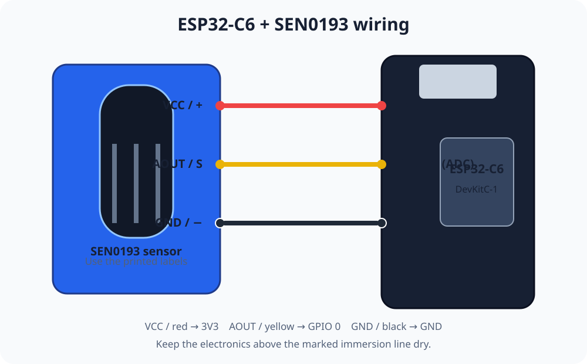

# ESP32 SEN0193 土壤湿度实时看板技能

[英文版](README.md)

这个技能用于构建完整的 ESP32-C6 与 Capacitive Soil Moisture Sensor V2.0（SEN0193）监控器，包括接线、校准、项目生成、MQTT 配置、烧录验证，以及本地或 Cloudflare 远程看板。

## 使用方法

```sh
git clone https://github.com/emqx/thing-loom.git
cd thing-loom/sen0193
codex
```

然后输入：`帮我构建一个土壤湿度监控器。`



请按照传感器丝印接线：

| SEN0193 | ESP32-C6 |
|---|---|
| `VCC` / 红线 / `+` | `3V3` |
| `GND` / 黑线 / `-` | `GND` |
| `AOUT` / 黄线 / `S` | `GPIO 0` |

该传感器支持 3.3-5.5V 供电，模拟输出为 0-3.0V；本文固定使用 3.3V。禁止让探针浸水线以上的电子元件接触水。

## 校准

生成的固件会同时上报传感器毫伏值和 0-100% 归一化湿度。看板会解释换算方法、显示校准点，并将 0-29% 标为干燥、30-69% 标为湿润、70-100% 标为潮湿。默认干/湿值 2500/1250 mV 只用于起步。分别记录探针在空气和水中的稳定读数（不得超过浸水线），再运行：

```sh
scripts/scaffold.py data/my-plant --dry-mv <空气读数> --wet-mv <水中读数>
```

插入深度和土壤密实度都会影响读数；需要可比较的数据时，应按实际安装条件重新校准。

## 发布方式与安全

- **本地页面：**不需要 Cloudflare 账户或部署。
- **远程地址：**使用 Cloudflare Workers 静态资源，最小权限 Token 只通过终端隐藏提示输入。

默认使用一次性的 Zero EMQX。`--broker custom` 可配置自有 MQTT 与 WebSocket 入口，并由 MQTTX 验证。凭据只在本地输入，写入 `data/<项目>` 下权限为 `600` 的 Git 忽略文件。远程静态看板会向访客暴露演示用 MQTT 凭据；私有或生产看板需要带鉴权的后端。

## 默认硬件与工具

- ESP32-C6-DevKitC-1
- SEN0193 Capacitive Soil Moisture Sensor V2.0
- USB-C 数据线和 2.4 GHz 无线网络

Arduino 侧只需要 ESP32 Core 和 `PubSubClient`；模拟采样直接使用 Arduino-ESP32 原生 ADC API。
